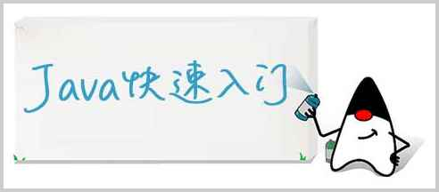

<!-- TRANSLATED by md-translate -->
# Quick start

This chapter focuses on getting up to speed on the basics of Java programs, understanding and using variables and various data types, and introducing basic program flow control statements.

This chapter allows you to write basic Java programs.