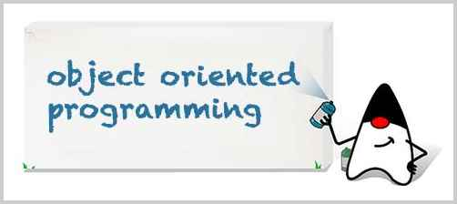

<!-- TRANSLATED by md-translate -->
# Object-oriented programming

Java is an object-oriented programming language. Object-Oriented Programming, in English, is Object-Oriented Programming, or OOP for short.

So what is object-oriented programming?

Different from object-oriented programming is process-oriented programming. Procedure-oriented programming, is breaking down the model into a step-by-step process. For example, if your boss tells you to write a TODO task, you must follow these steps step by step:

1. reading documents;
2. writing the TODO;
3. saving the file.


And with object-oriented programming, as the name suggests, you have to have an object in the first place:


Once you have an object, you can interact with it:

```java
GirlFriend gf = new GirlFriend();
gf.name = "Alice";
gf.send("flowers");
```

Object-oriented programming, therefore, is a programming method that maps the real world to a computer model by means of objects.

In this chapter, we will discuss:

Basic object-oriented concepts, including:

* Class
* Instance
* Methods

Object-oriented implementations, including:

* Inheritance
* Polymorphism

The Java language itself provides mechanisms, including:

* package
* classpath
* jar

and the core classes provided by the Java Standard Library, including:

* String
* Packaged types
* JavaBean
* Enumerations
* Common utility classes

By the end of this chapter, it is entirely possible to understand and master the basic ideas of object orientation, but there is no guarantee that you will be able to find objects.

