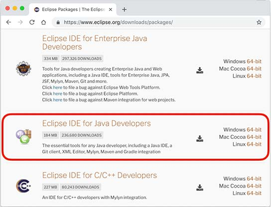
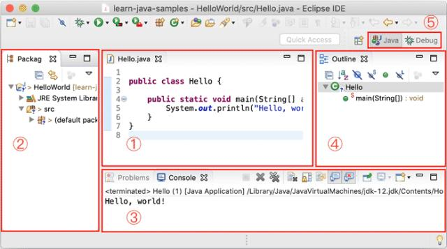
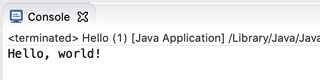

<!-- TRANSLATED by md-translate -->
# Using the IDE

IDE stands for Integrated Development Environment.

The advantage of using an IDE is that you can put writing code, organizing the project, compiling, running, debugging, etc. into a single environment to run, which can greatly improve the efficiency of development.

IDE improves development efficiency mainly by the following points:

* The editor's auto-prompting can greatly improve the speed of knocking out code;
* Code can be automatically recompiled after modification and run directly;
* You can easily debug at breakpoints.

Currently, the popular IDEs for Java development are:

### Eclipse

[Eclipse](https://www.eclipse.org/) is developed by IBM and donated to the open source community of an IDE , but also the most widely used IDE. Eclipse is characterized by its own Java development , and based on the plug-in structure , even if the support for Java development is also realized through the plug-in JDT .

In addition to Java development , Eclipse with plug-ins can also be used as a C / C + + development environment , PHP development environment , Rust development environment and so on.

### IntelliJ Idea

[IntelliJ Idea](https://www.jetbrains.com/idea/) is a powerful IDE developed by JetBrains, which is divided into free version and commercial paid version. JetBrains IDE platform is also based on IDE platform + language plug-in mode, supports Python JetBrains IDE platform is also based on the IDE platform + language plug-ins model, supporting Python development environment, Ruby development environment, PHP development environment, etc., these development environments are also divided into free and paid version.

### NetBeans

[NetBeans](https://netbeans.org/) is the earliest open source IDE developed by SUN, which is no longer popular due to the small number of users.

### Using Eclipse

You can use any IDE for Java learning and development. Without discussing anything about the advantages and disadvantages of IDEs, this tutorial uses Eclipse as the development demo environment for a number of reasons:

* Completely free to use;
* All features fully meet Java development requirements.

### Install Eclipse

The Eclipse distribution provides pre-packaged development environments for Java, JavaEE, C++, PHP, Rust, and more. Download it from [here](https://www.eclipse.org/downloads/packages/):

The version we need to download is Eclipse IDE for Java Developers:

Depending on whether the operating system is Windows, Mac or Linux, select the corresponding download link from the right.

> [!NOTICE]注意
>
> 教程从头到尾并不需要用到Enterprise Java的功能，所以不需要下载Eclipse IDE for Enterprise Java Developers

### Setting up Eclipse

After downloading and installing, we start Eclipse and do a basic setup of the IDE environment:

Select the menu "Eclipse/Window" - "Preferences", open the configuration dialog box:

We need to adjust the following setting items:

#### General > Editors > Text Editors

Hook "Show line numbers" so that the editor will show the line numbers;

#### General > Workspace

Hook "Refresh using native hooks or polling", so that Eclipse will automatically refresh the folder changes;

For "Text file encoding", if Default is not `UTF-8`, make sure to change it to "Other: UTF-8", all text files use `UTF-8` encoding;

For "New text file line delimiter", it is recommended to use Unix, which uses `\n` for line breaks instead of `\r\n` for Windows.

#### Java > Compiler

By setting the "Compiler compliance level" to `20`, all code in this tutorial uses Java 20 syntax and compiles to Java 20.

Remove "Use default compliance settings" and hook "Enable preview features for Java 20" so that we can use the preview features of Java 20. 20 preview features.

> [!NOTICE]注意
>
> 如果Compiler compliance level没有22这个选项，请更新到最新版Eclipse。如果更新后还是没有22，打开Help - Eclipse Marketplace，搜索Java 22 Support安装后重启即可。

#### Java > Installed JREs

You should see Java SE 20 in the Installed JREs, and if there are other JREs, you can remove them to ensure that Java SE 20 is the default JRE.

### Eclipse IDE structure

When you open Eclipse, the entire IDE consists of several areas:

* The editable text area in the center (see 1) is the editor, which is used to edit the source code;
* Distributed to the left, right and bottom are views:
    - Package Explorer (see 2) is the Java project view
    - Console (see 3) is the command line output view
    - Outline (see 4) is a view of the structure of the Java source code you are currently editing.
* The views can be arbitrarily combined, and then a group of views defined as a Perspective (see 5), Eclipse predefined Java, Debug, and several other Perspective, for rapid switching.

### New Java project

In the Eclipse menu select "File" - "New" - "Java Project", fill in `HelloWorld`, JRE Select `Java SE 22`:

Don't check "Create module-info.java file" for now, because we will talk about the modularization mechanism later:

Clicking "Finish" creates a Java project named `HelloWorld`.

### Create a new Java file and run it

Expand the `HelloWorld` project, select the source directory `src`, right-click, and choose "New"-"Class" in the popup menu:

In the dialog box that pops up, put `Hello` in the `Name` field:

Clicking "Finish" automatically creates a source file named `Hello.java` in the `src` directory. Let's double-click on it to open the source file and fill in the code:

Save it, then select the file `Hello.java`, right-click on it, and in the pop-up menu, select "Run As...". - "Java Application":

The results of the run can be seen in the `Console` window:

If you don't see the `Console` window in the main interface, check the menu "Window" - "Show View" - "Console". The `Console` window will be displayed.