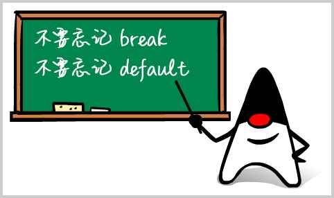

<!-- TRANSLATED by md-translate -->
# switch multiple choices

In addition to the `if` statement, there is also a conditional judgment that goes to separate branches depending on the result of a certain expression.

For example, in a game, let the user choose options:

1. Single-player mode
2. Multiplayer mode
3. Exit game

This is where the `switch` statement comes in handy.

The `switch` statement jumps to the matching `case` result based on the result of the `switch (expression)` computation, and then continues to execute subsequent statements until it encounters `break` to end execution.

Let's look at an example:

```java
// switch
public class Main {
    public static void main(String[] args) {
        int option = 1;
        switch (option) {
        case 1:
            System.out.println("Selected 1");
            break;
        case 2:
            System.out.println("Selected 2");
            break;
        case 3:
            System.out.println("Selected 3");
            break;
        }
    }
}
```

Modify the values of `option` to `1`, `2` and `3` and observe the execution results.

If the value of `option` does not match any `case`, for example `option = 99`, then the `switch` statement will not execute any statements. In this case, you can add a `default` to the `switch` statement to execute the `default` when no `case` is matched:

```java
// switch
public class Main {
    public static void main(String[] args) {
        int option = 99;
        switch (option) {
        case 1:
            System.out.println("Selected 1");
            break;
        case 2:
            System.out.println("Selected 2");
            break;
        case 3:
            System.out.println("Selected 3");
            break;
        default:
            System.out.println("Selected other");
            break;
        }
    }
}
```

If the `switch` statement is translated into an `if` statement, then the above code is equivalent:

```java
if (option == 1) {
    System.out.println("Selected 1");
} else if (option == 2) {
    System.out.println("Selected 2");
} else if (option == 3) {
    System.out.println("Selected 3");
} else {
    System.out.println("Selected other");
}
```

In contrast to `if ... else if` statements, it is clearer to use the `switch` structure for multiple `==` judgments.

Also note that the above "translations" only work if the `break` statement is written correctly for each `case` in the `switch` statement.

When using `switch`, note that the `case` statement does not have the parentheses `{}`, and that the `case` statement is "_penetrating_" and omitting `break` will lead to unexpected results:

```java
// switch
public class Main {
    public static void main(String[] args) {
        int option = 2;
        switch (option) {
        case 1:
            System.out.println("Selected 1");
        case 2:
            System.out.println("Selected 2");
        case 3:
            System.out.println("Selected 3");
        default:
            System.out.println("Selected other");
        }
    }
}
```

When `option = 2`, `"Selected 2"`, `"Selected 3"`, and `"Selected other"` will be output in order, the reason being that starting from the match to `case 2`, the subsequent statements will be executed in their entirety until a `break` statement is encountered. So don't forget to write `break` at any time.

If there are several `case` statements executing the same set of statement blocks, you can write it this way:

```java
// switch
public class Main {
    public static void main(String[] args) {
        int option = 2;
        switch (option) {
        case 1:
            System.out.println("Selected 1");
            break;
        case 2:
        case 3:
            System.out.println("Selected 2, 3");
            break;
        default:
            System.out.println("Selected other");
            break;
        }
    }
}
```

When using `switch` statements, the order of the `cases` does not affect the program logic as long as a `break` is guaranteed:

```java
switch (option) {
case 3:
    ...
    break;
case 2:
    ...
    break;
case 1:
    ...
    break;
}
```

However, it is still recommended that they be arranged in natural order for ease of reading.

The `switch` statement can also match strings. String matching compares "equal content". For example:

```java
// switch
public class Main {
    public static void main(String[] args) {
        String fruit = "apple";
        switch (fruit) {
        case "apple":
            System.out.println("Selected apple");
            break;
        case "pear":
            System.out.println("Selected pear");
            break;
        case "mango":
            System.out.println("Selected mango");
            break;
        default:
            System.out.println("No fruit selected");
            break;
        }
    }
}
```

The `switch` statement can also use enumerated types, which we explain later.

### Compilation check

When using the IDE, you can automatically check for missed `break` statements and `default` statements by turning on the IDE's compile check.

In Eclipse, select `Preferences` - `Java` - `Compiler` - `Errors/Warnings` - `Potential programming problems` and mark the following checks as Warning:

* 'switch' is missing 'default' case: warn when a `default` statement is missing;
* 'switch' case fall-through: warn when a `case` is missing a `break`.

In Idea, select `Preferences` - `Editor` - `Inspections` - `Java` - `Control flow issues` and mark the following check as Warning:

* 'switch' statement without 'default' branch: warn when a `default' statement is missing;
* Fallthrough in 'switch' statement: warn when `break' is missing from a `case'.

When there is a problem with a `switch` statement, you can get a warning alert in the IDE.



### Switch expressions

When using `switch`, omitting `break` can cause serious logical errors that are not easily detected in the source code. Starting in Java 12, the `switch` statement was upgraded to a more concise expression syntax that uses a Pattern Matching-like approach to ensure that only one path will be executed, and does not require a `break` statement:

```java
// switch
public class Main {
    public static void main(String[] args) {
        String fruit = "apple";
        switch (fruit) {
        case "apple" -> System.out.println("Selected apple");
        case "pear" -> System.out.println("Selected pear");
        case "mango" -> {
            System.out.println("Selected mango");
            System.out.println("Good choice!");
        }
        default -> System.out.println("No fruit selected");
        }
    }
}
```

Note that the new syntax uses `->` and needs to be enclosed in `{}` if there are multiple statements. Don't write `break` statements, because the new syntax will only execute matching statements, _without_ penetration effects.

Very often, we may also use a `switch` statement to assign a value to a variable. For example:

```java
int opt;
switch (fruit) {
case "apple":
    opt = 1;
    break;
case "pear":
case "mango":
    opt = 2;
    break;
default:
    opt = 0;
    break;
}
```

With the new `switch` syntax, not only do you not need `break`, but you can also return the value directly. Rewrite the above code as follows:

```java
// switch
public class Main {
    public static void main(String[] args) {
        String fruit = "apple";
        int opt = switch (fruit) {
            case "apple" -> 1;
            case "pear", "mango" -> 2;
            default -> 0;
        }; // 注意赋值语句要以;结束
        System.out.println("opt = " + opt);
    }
}
```

This results in cleaner code.

### yield

Most of the time, inside `switch` expressions, we return simple values.

However, if complex statements are needed, we can also write many statements, put them into `{...} `, and then, using `yield`, return a value as the return value of the `switch` statement:

```java
// yield
public class Main {
    public static void main(String[] args) {
        String fruit = "orange";
        int opt = switch (fruit) {
            case "apple" -> 1;
            case "pear", "mango" -> 2;
            default -> {
                int code = fruit.hashCode();
                yield code; // switch语句返回值
            }
        };
        System.out.println("opt = " + opt);
    }
}
```

### Exercise

Implement a simple rock, paper, scissors game using `switch`.

[Download exercise](flow-switch.zip)

### Summary

The `switch` statement can make multiple choices and then execute the code that follows the matching `case` statement;

The result of a `switch` calculation must be an integer, string, or enumeration type;

Be careful never to leave out `break`, it is recommended to turn on the `fall-through` warning;

Always write `default` and suggest turning on the `missing default` warning;

Starting with Java 14, `switch` statements are officially upgraded to expressions, eliminating the need for `break` and allowing the use of `yield` return values.