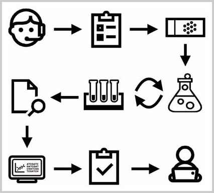

<!-- TRANSLATED by md-translate -->
# Process control

In a Java program, the JVM always executes statements ending with a semicolon `;` sequentially by default. However, in actual code, programs often need to do conditional judgments, loops, so there is a need to have a variety of flow control statements to achieve the program jumps and loops and other functions.

In this section we will cover `if` conditional judgment, `switch` multiple choice and various looping statements.